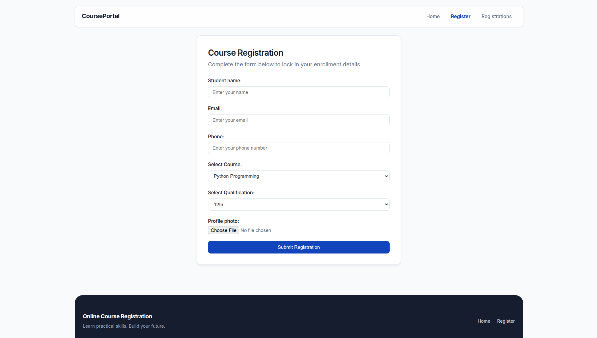
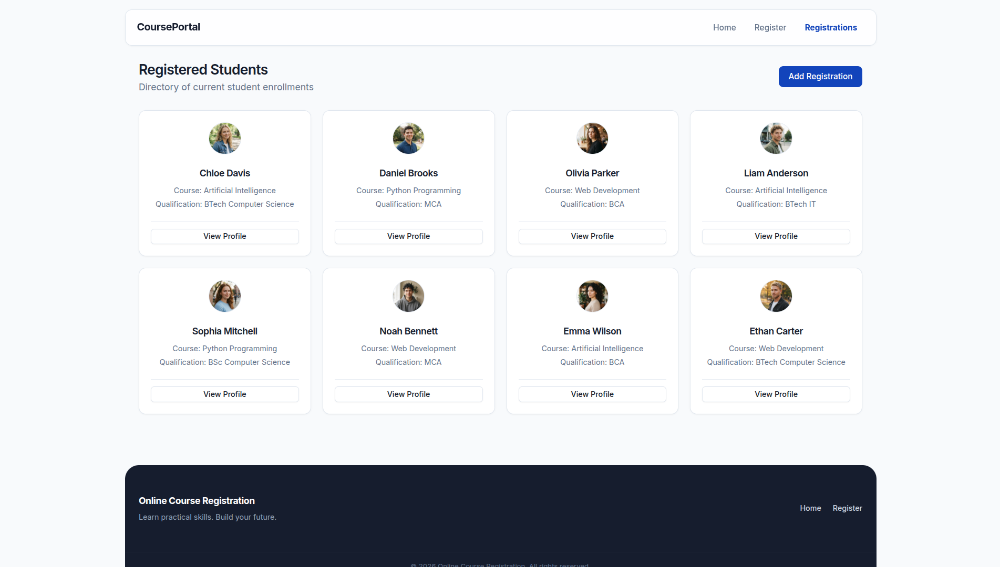
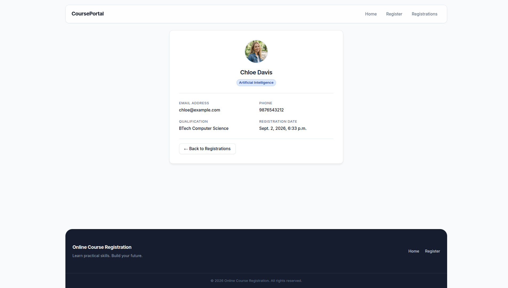

# Online Course Registration System

A professional Django-based web application designed to manage student enrollments in various technical courses.

## Features

- **Course Registration:** An intuitive form for students to enroll in courses.
- **Profile Photo Uploads:** Seamless handling of media files for student profile pictures.
- **Student Directory:** A comprehensive list view displaying all registered students.
- **Detailed Profiles:** Individual detail pages for each student to view their complete enrollment information.
- **Admin Dashboard:** Full integration with the Django admin interface for easy management of registrations (Create, Read, Update, Delete).

## Screenshots

<details>
  <summary>Click to view screenshots</summary>

  
  
  
  
</details>

## Tech Stack

- **Backend:** Python, Django
- **Frontend:** HTML5, CSS3, Vanilla JavaScript
- **Database:** SQLite

## Setup Instructions

Follow these steps to run the project locally:

1. **Navigate to the project directory:**
   ```bash
   cd course-reg
   ```

2. **Create and activate a virtual environment:**
   ```bash
   python3 -m venv .venv
   source .venv/bin/activate  # On Windows use: .venv\Scripts\activate
   ```

3. **Install required dependencies:**
   ```bash
   pip install django
   ```

4. **Navigate to the core Django project directory:**
   ```bash
   cd OCR_project
   ```

5. **Apply database migrations:**
   ```bash
   python manage.py makemigrations
   python manage.py migrate
   ```

6. **Create a superuser for the admin dashboard (optional but recommended):**
   ```bash
   python manage.py createsuperuser
   ```

7. **Run the development server:**
   ```bash
   python manage.py runserver
   ```

8. **Access the application:**
   - **Web App:** [http://127.0.0.1:8000/](http://127.0.0.1:8000/)
   - **Admin Panel:** [http://127.0.0.1:8000/admin/](http://127.0.0.1:8000/admin/)

## Project Structure

- `OCR_project/` - Core Django settings and configurations.
- `OCR_app/` - The main application containing models, views, forms, and URLs.
  - `templates/` - HTML templates extending a common `base.html`.
  - `static/` - CSS styling, JavaScript functionalities, and static assets.
- `media/` - Directory for user-uploaded files (like profile photos).
